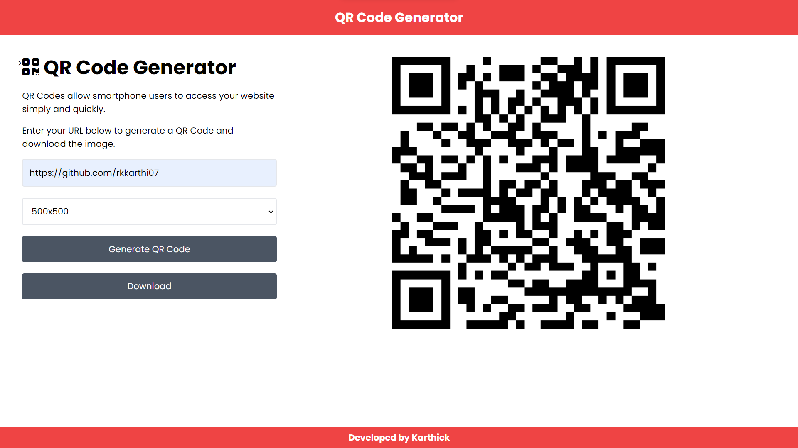

# QR Code Generator

Generate QR codes for website URLs easily with this simple web application.

## Live Demo

Visit the [Live Demo](https://rkkarthi07.github.io/QR_code_Generator) to try the QR Code Generator.

## Functionality

- **QR Code Generation:** Enter a website URL and choose the QR code size to generate QR codes quickly.
- **Customizable Size:** Select from various size options (e.g., 100x100, 200x200, etc.) for the generated QR code.
- **Download QR Code:** Save the generated QR code as an image for offline use.

## Getting Started

Enter the required URL to generate the QR code and view the QR code
Download it for further purpose

### Prerequisites

Make sure you have a modern web browser installed.
